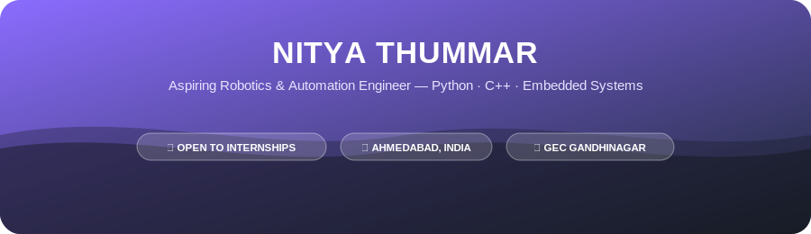

<div align="center">



<br/>

[](https://www.linkedin.com/in/nitya-thummar-14b3362bb)
[](mailto:nityathummar@gmail.com)
[](https://www.instagram.com/nitya_patel_17)

</div>

<br/>

### 🔎 Who I Am

```python
class Nitya:
    def __init__(self):
        self.role        = "Robotics & Automation Engineering Student"
        self.college      = "Government Engineering College, Gandhinagar"
        self.year         = "4th Year (2023 - Present)"
        self.interests    = ["Embedded Systems", "IoT", "Mechatronics", "Control Systems"]
        self.languages    = ["Python", "C++", "MATLAB"]
        self.currently    = "Looking for an internship to build real, production-grade systems"

    def say_hi(self):
        print("Thanks for stopping by — let's build something! 🚀")
```

<br/>

### 🛠️ Tech Stack

<div align="center">


</div>

<br/>

### 🚀 Featured Project

<table>
<tr>
<td width="100%">

**🌊 Autonomous Solar-Powered Marine Vessel**
*Role: Control Systems & Software Developer*

Built a functional prototype of a solar-powered boat for sustainable water transport. Integrated photovoltaic (PV) cells with a battery management system, programmed an Arduino to regulate motor speed & steering from real-time battery voltage data, and designed the full electronic circuit layout with waterproof housing.

`Arduino` `Embedded C` `Power Systems` `Control Logic`

</td>
</tr>
</table>

<br/>

### 📊 Academic Snapshot

<div align="center">

</div>

<br/>

<div align="center">

### 💬 Let's Connect


<br/><br/>

[](https://www.linkedin.com/in/nitya-thummar-14b3362bb)
[](https://www.instagram.com/nitya_patel_17)
[](mailto:nityathummar@gmail.com)
[](tel:+918320144987)

</div>


